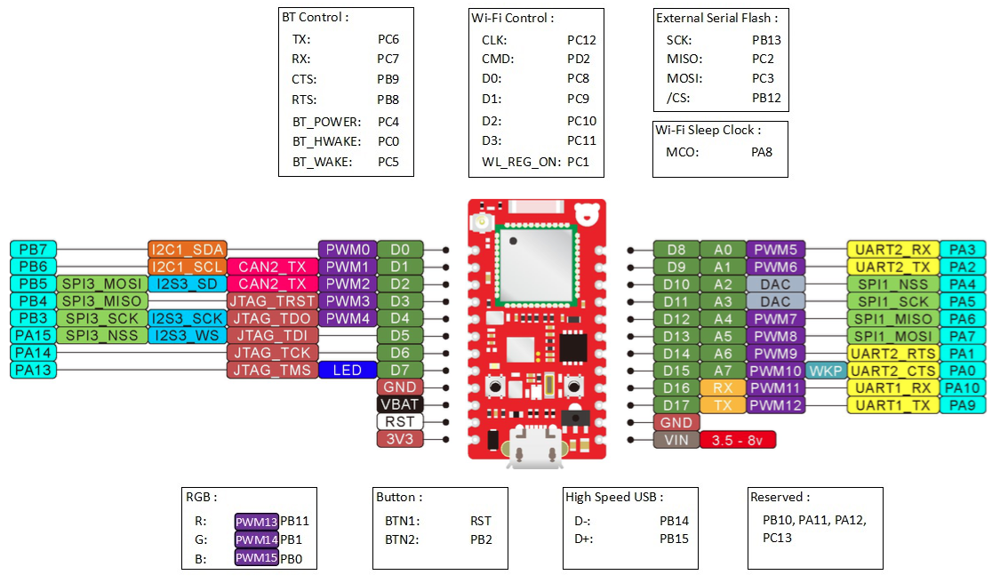
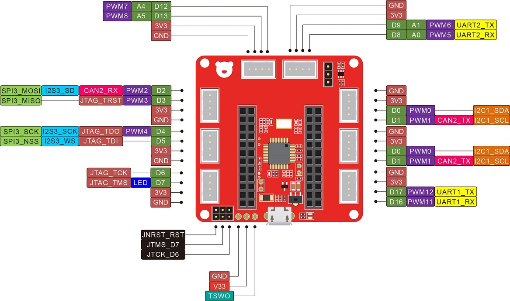

.. _redbear_duo_board:

REDBEAR DUO
###########

Overview
********

The Redbear Duo board is a small board (40 x 20 x 13 mm) features:

- an ARM Cortex-M3 based STM32F205 MCU at 120MHz, 128KB of SRAM and
  1MB of flash;
- a broadcom BCM43438 Wi-Fi 802.11n (2.4GHz only) and Bluetooth 4.1
  (Dual Mode) combo chip;
- an on-board 16 Mbit (2 MB) SPI flash;
- an USB port, used to power the board;
- a RGB LED and a blue LED;
- two small push-buttons: *setup* (i.e. user) and *reset*;

More information about the board can be found at the `Redbear Duo
Github page`_.
  
The RBLink is a Redbear Duo compagnon board is:
- **needed** to programs and debug the Redbear Duo board
- useful to prototype.

It features:

- an ST-Link/v2 adaptater;
- a serial to USB converter for RedBear Duo UART1;
- 8 Seeed Grove System compatible connectors.

More information about the RBLink board can be found at the `Redbear
RBLink introduction`_.

Hardware
********

Redbear Duo provides the following hardware components:

- STM32F205 in WLCSP64 package
- ARM 32-bit Cortex-M3 CPU
- 120 MHz max CPU frequency
- VDD from 1.7 V to 3.6 V
- 1 MB Flash
- 128 KB SRAM
- RTC
- Advanced-control Timer
- General Purpose Timers (7)
- Watchdog Timers (2)
- 18 GPIO with external interrupt and wake up capabilities
- 12-bit ADC (8)
- PWM (13)
- USART/UART (2)
- I2C (1)
- SPI (2)
- CAN (1)
- DAC (1)
- USB 2.0 OTG FS
- DMA Controller

Details on:

- `STM32F205 reference manual`_
- `STM32F205xx Datasheet`_

  
Supported Features
==================

+-----------+------------+-------------------------------------+
| Interface | Controller | Driver/Component                    |
+===========+============+=====================================+
| NVIC      | on-chip    | nested vector interrupt controller  |
+-----------+------------+-------------------------------------+
| UART      | on-chip    | serial port                         |
+-----------+------------+-------------------------------------+
| GPIO      | on-chip    | gpio                                |
+-----------+------------+-------------------------------------+
| PWM       | on-chip    | pwm                                 |
+-----------+------------+-------------------------------------+

Other hardware features are not yet supported on Zephyr porting.

The default configuration can be found in the defconfig file:

	``boards/arm/redbear_duo/redbear_duo_defconfig``

Pin Mapping
===========

Available pins:
---------------

For mode details please refer to `Redbear Duo introduction`_. Given
the RBLink is needed to program and debug, here is the RBLink pin map:

For mode details please refer to `Redbear RBLink introduction`_.

Default Zephyr Peripheral Mapping:
----------------------------------

- UART1 and UART2 on pinmap are the same as zephyr;

System Clock
============

Redbear Duo System Clock could be driven by internal or external
oscillator, as well as main PLL clock. By default System clock is
driven by PLL clock at 120MHz, driven by 26MHz high speed external
clock.

Serial Port
===========

Redbear Duo board has 2 UARTs. The Zephyr console output is assigned
to UART2, the one converted to USB by RBLink. Default settings are
115200 8N1.

Status
******

Samples working as is with the RBlink:

[x] hello_world
[x] basic/blinky
[ ] basic/rgb_led
[x] basic/blink_led
[x] basic/fade_led
[ ] basic/disco
[x] basic/button
[ ] basic/servo_motor

Programming and Debugging
*************************

Flashing
========

Redbear Duo card must be programmed with the Rblink kit. This
interface is supported by the openocd version included in Zephyr SDK.

Flashing an application to REDBEAR Duo
--------------------------------------

The sample application :ref:`hello_world` is being used in this tutorial:

.. code-block:: console

   $<zephyr_root_path>/samples/hello_world

To build the Zephyr kernel and application, enter:

.. code-block:: console

   $ cd <zephyr_root_path>
   $ source zephyr-env.sh
   $ cd $ZEPHYR_BASE/samples/hello_world/
   $ make BOARD=stm32f3_disco

Connect the RBlink to your host computer using the USB port. Then,
enter the following command:

.. code-block:: console

   $ make BOARD=stm32f3_disco flash

Run a serial host program to connect with your board at `115200 8N1`.

.. code-block:: console

   $ minicom -D /dev/ttyACM0

Or simplier:

.. code-block:: console

   $ screen /dev/ttyACM0 115200,cs8,-parenb,-cstopb,-hupcl

You should see the following message:

.. code-block:: console

   Hello World! arm

Debugging
=========

Access gdb with the following make commands work:

.. code-block:: console

   $ make BOARD=redbear_duo serverdebug
   $ make BOARD=redbear_duo debug

.. _Redbear Duo Github page:
   https://github.com/redbear/Duo

.. _Redbear Duo introduction:
   https://github.com/redbear/Duo/blob/master/docs/duo_introduction.md

.. _Redbear RBLink introduction:
   https://github.com/redbear/Duo/blob/master/docs/rblink_introduction.md

.. _STM32F205 reference manual:
   http://www.st.com/resource/en/reference_manual/CD00225773.pdf

.. _STM32F205xx Datasheet:
   http://www.st.com/resource/en/datasheet/stm32f207vg.pdf
